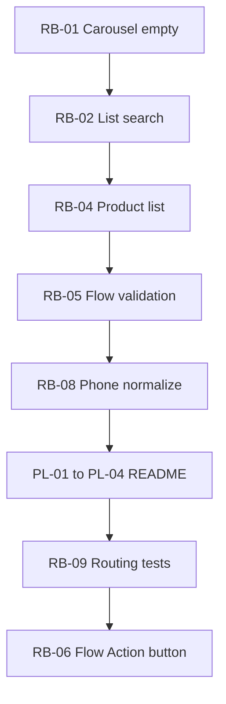

# Final backlog — use and forget

**Versão auditada:** 0.6.1  
**Gerado:** Pass 08 triage (dedupe Pass 01–07)  
**Escopo fix:** automação only · Custom API Call = ACCEPT

**Definição release-ready:** P0 = 0, P1 = 0 no caminho feliz das 10 jornadas ([PASS-08-journey-matrix.md](PASS-08-journey-matrix.md)).

---

## Release blockers (P0 + P1) — 9 items

| ID | Sev | Título | Esforço | Pass | Arquivos-chave |
|----|-----|--------|---------|------|----------------|
| RB-01 | **P0** | Carousel mode vazio emite standard components | S | 03 | templateComponents.ts:320-349 |
| RB-02 | **P1** | List search filtra só 5 rows localmente | M | 04,06 | listSearch.ts:25-92 |
| RB-03 | **P1** | contactValue fallback para phone/wa_id | S | 04 | listSearch.ts:66-69 |
| RB-04 | **P1** | sendProductList mock + seções sem produtos | S | 02 | mockExecuteFunctions.ts, validation.ts |
| RB-05 | **P1** | sendFlow: validar cta/token vazios | S | 02 | routing.ts:424-461 |
| RB-06 | **P1** | Template button “Flow Action” não implementado | M | 03 | templateComponents.ts:208-212 |
| RB-07 | **P1** | recipientComponentsJson aceita `[]` | S | 03 | templateComponents.ts:310-317 |
| RB-08 | **P1** | Formato telefone inconsistente (contact/message/block) | S | 04 | resource.fields.ts, platformPayloads |
| RB-09 | **P1** | Routing integration envelope-only (regressão) | L | 02 | routing.integration.test.ts |

**Estimativa blockers:** ~2–3 dias (RB-09 domina se fizer 1 teste/op).

---

## 0.6.x polish (P2 barato) — 11 items

| ID | Sev | Título | Esforço | Pass |
|----|-----|--------|---------|------|
| PL-01 | P2 | README: Kapso Media → Meta Resumable Asset | S | 01,05 |
| PL-02 | P2 | README: 3 trigger→API recipes | S | 07 |
| PL-03 | P2 | README: cadeia upload → Send Image | S | 05,08 |
| PL-04 | P2 | README: template step 4 sem Advanced JSON | S | 01 |
| PL-05 | P2 | Template header media/text required quando tipo exige | S | 03 |
| PL-06 | P2 | parseCoordinate range + validation.test.ts | S | 02 |
| PL-07 | P2 | Expression hints em messageId/mediaId/platformMessageId | S | 05,06 |
| PL-08 | P2 | platformMessageConversationId → resourceLocator | M | 05,06 |
| PL-09 | P2 | broadcastListPhoneNumberId → getPhoneNumbers | S | 06 |
| PL-10 | P2 | Date filters normalizar ISO | S | 04 |
| PL-11 | P2 | sendCtaUrl test arg order + footer assert | S | 02 |

**Estimativa polish:** ~1 dia.

---

## Deferred (não bloqueia use-and-forget)

| Item | Razão |
|------|-------|
| ingestPhoneNumberId vs phoneNumberId unificado | UX; funciona |
| Carousel cardIndex uniqueness | Edge case |
| Broadcast cursor pagination | API page-based OK |
| Platform Message date filters | API gap TBD |
| sendLocation Null Island defaults | UI required mitiga |
| Interactive header text optional | DEFER |
| HMAC rawBody | ACCEPT n8n limitation |
| sendContact reply-to | ACCEPT Meta constraint |
| Advanced JSON bypass | ACCEPT escape hatch |
| recipientsBodyJson | ACCEPT escape hatch |

---

## Ordem de implementação sugerida



1. **0.6.2 (quick win):** RB-01, RB-04, RB-05, RB-07, RB-08, PL-01–PL-04, PL-06, PL-07  
2. **0.6.3:** RB-02, RB-03, PL-08, PL-09  
3. **0.7.0:** RB-06, RB-09 (test suite expansion)

---

## Contagem

| Severidade | Total findings | FIX | DEFER | ACCEPT |
|------------|----------------|-----|-------|--------|
| P0 | 1 | 1 | 0 | 0 |
| P1 | 8 | 8 | 0 | 0 |
| P2 | ~25 | 11 backlog | ~10 deferred | ~4 accept |

**Backlog items:** 20 (9 blockers + 11 polish) — **exit criteria met**.

---

## Próximo passo

Implementar **RB-01 through RB-08 + PL-01–PL-04** num único release 0.6.2 para congelar UX; RB-09 e RB-02 podem ser paralelos se tempo permitir.

Prompt para implementação:

```text
Implemente review/FINAL-BACKLOG.md release blockers RB-01 a RB-08 e polish PL-01 a PL-04.
Sem backward compatibility. Bump 0.6.2 + CHANGELOG.
```
